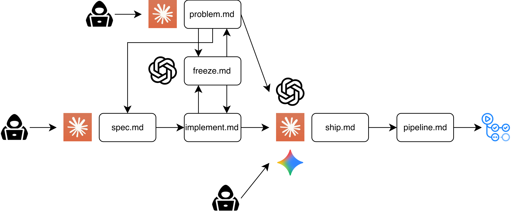

# SDD — Specification-Driven Development and the Automation Harness

English | [한국어](sdd.ko.md)

This repository is developed by one person working with AI agents: Claude Code implements, while
Codex independently derives acceptance tests. AI provides speed; quality is protected by
**mechanical controls**—hooks, gates, audits, and CI—rather than relying on human attention. This
document explains that system. The linked procedures remain the canonical rules; this page focuses
on the structure and its verification path.

## The Loop: Spec → Freeze → Implement → Ship

1. **Spec** — Each step starts with a one-page [specification](specs/), beginning at step 05. Steps
   1–4 used [architecture.md](architecture.md) itself as their specification and predated the harness.
   Numbers are established through **measurement, not conjecture**. Decision forks—policy, trade-offs,
   and scope—are confirmed with the user, then recorded with their rationale. Entry point:
   [.claude/commands/spec.md](../.claude/commands/spec.md).
2. **Test freeze** — Acceptance e2e tests are written before implementation and pinned in a commit.
   The core rule is that **the same agent must not create both the referee (tests) and the player
   (implementation)**. Otherwise, a misreading of the spec can be copied into both sides and allow
   them to validate each other. Codex derives tests independently from the spec; the implementation
   harness only prepares stubs, reviews the result, and freezes it. Canonical procedure:
   [automation/freeze.md](../automation/freeze.md).
3. **Implementation** — Continue until every frozen test passes. The tests may not be changed; see
   [How the Freeze Is Enforced](#how-the-freeze-is-enforced). Entry point:
   [.claude/commands/implement.md](../.claude/commands/implement.md).
4. **Ship** — The path from dev PR (squash) → CI → deployment PR (merge) → production CD is
   automated. Canonical procedure: [automation/pipeline.md](../automation/pipeline.md). Sensitive
   files are protected twice: by a commit-gate script and by a PreToolUse hook.

**Production issues** outside planned steps enter through
[/problem](../.claude/commands/problem.md). A human does not decide in advance whether the change
needs a spec. After diagnosis, the harness compares affected file paths against mechanical rules for
contracts, security, and new domains; a match promotes the work to a spec in place. The rule lives in
[architecture.md](architecture.md) §15, "Rules for work after step 5 (SDD)."

## How the Freeze Is Enforced

"Do not edit tests during implementation" is backed by three controls, not a declaration:

| Layer      | Control                                                                                         | What it catches                                                                                                                                                                                  |
| ---------- | ----------------------------------------------------------------------------------------------- | ------------------------------------------------------------------------------------------------------------------------------------------------------------------------------------------------ |
| Gate       | Three-part mechanical validation before freezing ([freeze.md](../automation/freeze.md), step 5) | Discovery—the runner actually collects the file; build GREEN; and **test-unit RED**. A test that cannot kill its stub is vacuous by definition.                                                  |
| Prevention | PreToolUse hook [freeze-test-files.sh](../.claude/hooks/freeze-test-files.sh)                   | Rejects Edit/Write tool calls targeting files on the frozen list.                                                                                                                                |
| Audit      | Post-implementation diff audit ([freeze.md](../automation/freeze.md), "Post-audit")             | Detects shell-based bypasses such as `sed -i`. The protected file list is reconstructed from the **freeze commit itself**, not a mutable state file, and the audit requires an empty `git diff`. |

When an implementation cannot pass the frozen tests, the **default hypothesis is an implementation
defect**; the burden of proof stays with the implementation. If a test appears wrong, it is not
patched in place. It becomes a specification-defect signal and enters TEST-DISPUTE: revise the spec
→ let Codex derive the tests again → freeze again. The rationale is preserved in the commit message.

## Rules Born from Failures

Most rules are corrective actions from real incidents, whose issue numbers remain in the record:

- Passing a compound acceptance criterion ("do A and B") as one item into test derivation can cause
  the test to **assert only the first behavior**. Criterion 8 in spec 23 passed the freeze gate and CI
  that way and reached production ([#120](https://github.com/Cure-Agent/cure-agent-be/issues/120)).
  Acceptance criteria are now split into behavior-sized units during spec authoring.
- Using a spec number as `#N` in a commit title makes GitHub link it to an unrelated issue with the
  same number. The spec 18 implementation actually linked itself to issue #18, "Deployment." Since
  then, `#N` always denotes an issue number.
- Reserving numbers for unwritten specs forces every reference to change whenever another spec is
  inserted ahead of them. The revision-detection scheduler moved from §20 to §23 across three
  renumberings, each requiring edits in four to six places. Spec numbers are now assigned only when
  the spec is written.

## Traceable Example — Spec 38 (Clinic Member Removal)

Follow this path to verify the claims in this document:

1. Spec: [specs/38-clinic-member-removal.md](specs/38-clinic-member-removal.md), merged into dev first
   through [PR #315](https://github.com/Cure-Agent/cure-agent-be/pull/315).
2. Implementation: [PR #319](https://github.com/Cure-Agent/cure-agent-be/pull/319). Its commit tab
   preserves all three stages: `[TEST/#318] 스텁 준비` (prepare stubs) →
   `[TEST/#318] … 수용 기준 테스트 동결 (작성: Codex)` (freeze acceptance tests, authored by
   Codex) → `[FEAT/#318] 구성원 강퇴` (remove clinic member).
3. PR body: a mapping of 39 acceptance criteria to tests, the freeze commit SHA, and the post-audit
   result.
4. Dev history: squash merging preserves "one line = one change": `[FEAT/#318] … (#319)`.

The same pattern is repeated in every subsequent implementation PR.

## Contract Pipeline (BE ↔ FE)

A DTO or controller change triggers `pnpm openapi:export`, regenerating and committing
`openapi/cure-agent.v1.json`. CI verifies that the committed contract equals the regenerated output
and checks for breaking changes with oasdiff. When main is updated, a `repository_dispatch`
automatically opens a type-synchronization PR in cure-agent-fe. The frontend calls the API through
those generated types, structurally preventing contract drift.

## Harness-Neutral Design

Canonical procedures live under [automation/](../automation/)—freeze, pipeline, ship, and problem—in
**harness-neutral** form. [.claude/commands/](../.claude/commands/) is the Claude Code adapter and
injects only harness-specific behavior such as polling mode and Co-Author trailers. This separation
keeps the procedure portable to another coding agent. CI/CD waits also use polling scripts from
[automation/bin/](../automation/bin/) rather than improvised loops: `pr-gate.sh` and `run-wait.sh`,
whose decision logic is covered by fixture smoke tests.

## Where Humans Intervene

The pipeline is automated, but humans retain three decision points:

- **Spec forks** — Policy, trade-offs, and scope are confirmed with the user, then recorded with the
  decision and its rationale in the spec.
- **TEST-DISPUTE approval** — User confirmation of a test or specification defect is itself the act
  that establishes the corrected specification.
- **Deployment approval** — This is the only intervention point between completed implementation and
  production. PRs auto-merge as soon as their gates pass; without this approval, there would be no
  intervention point at all. The harness therefore forbids skipping it
  ([implement.md](../.claude/commands/implement.md), phases 4–5).
